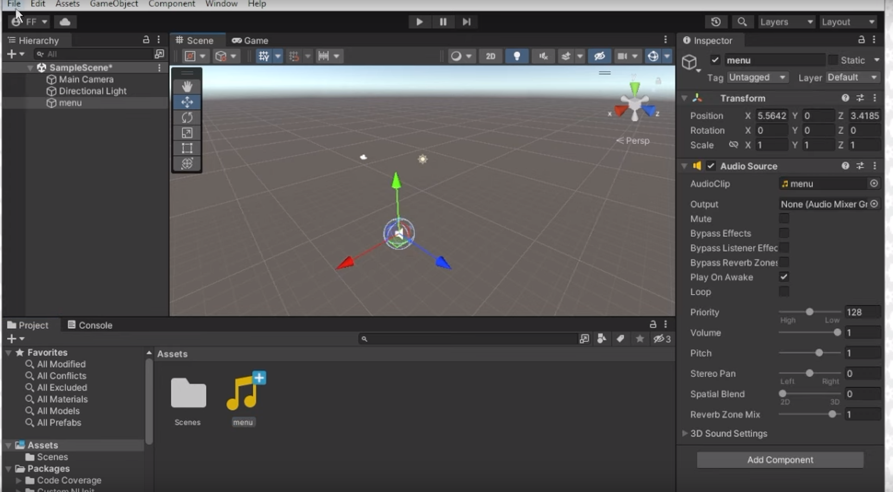
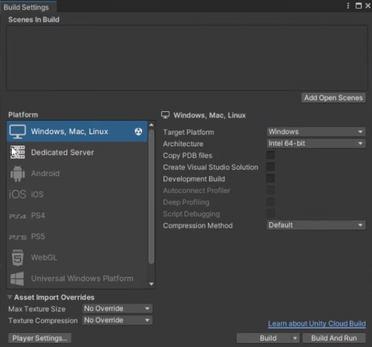
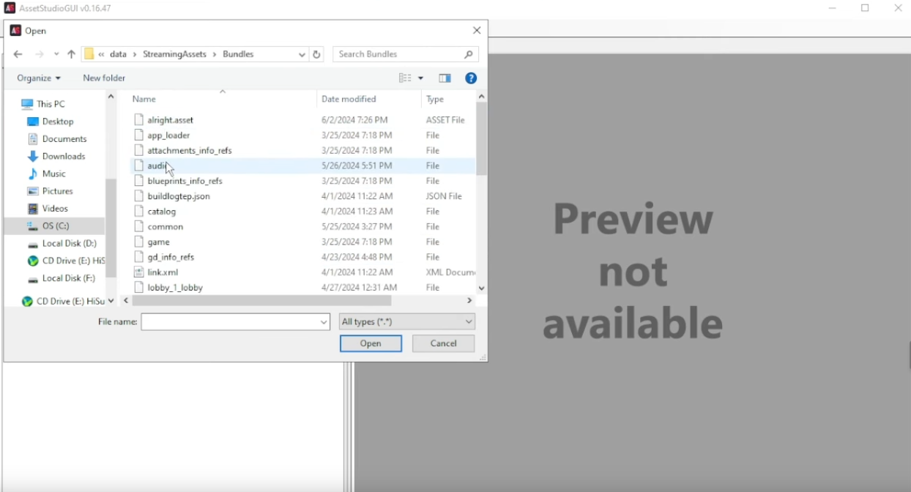
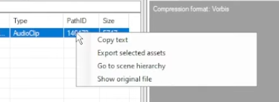
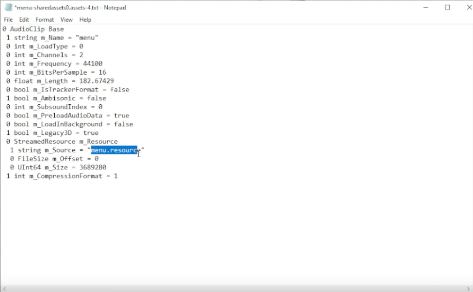

# 🔊 custom sound effects for unity 6 games (combat master example)

---

## 💡 overview

this guide will walk you through the pretty cool process of making and using your very own custom sound effects in games built with **unity 6**. even though "combat master" is used as a real-world example, the stuff here generally works for lots of unity 6 games. get ready to make your game's sound experience totally yours!

## ⚠️ disclaimer

just a heads up, this guide is mostly for learning and showing you how it's done. when you mess with game files, always make sure you're following all the rules, the game's terms of service, and respecting other people's stuff. changing game files can sometimes break things, make the game unstable, or even get your account in trouble. **so yeah, do it at your own risk.**

---

## 🛠️ stuff you'll need & who to thank

before you jump in, make sure you've got these essential apps downloaded and installed. i've put recommended versions where it matters to make sure everything plays nice with unity 6 and this guide.

* ### unity hub & unity editor (unity 6)
    * **why you need it:** to make a super simple unity project. this project will just be a little container to create a dummy `.assets` file with your custom audio, which we'll then use as a template.
    * **grab it here:** [https://unity.com/download](https://unity.com/download)

* ### assetstudiogui
    * **version:** `v0.18.0` (this one's important for this method to work).
    * **why you need it:** to pull out existing game assets (like the original sound effects) and, super important, find their special `pathid`.
    * **grab it here:** [https://github.com/aelurum/assetstudio/releases/tag/v0.18.0](https://github.com/aelurum/assetstudio/releases/tag/v0.18.0)

* ### uabea (unity asset bundle extractor)
    * **version:** specifically the **nightly version** that says it works with unity 6. older ones probably won't handle unity 6 files right.
    * **why you need it:** this powerful little tool is what you'll use to put your custom audio data right into the game's `.assets` files.
    * **grab it here:** [https://nightly.link/nesrak1/uabea/workflows/dotnet-desktop/master/uabea-windows.zip](https://nightly.link/nesrak1/uabea/workflows/dotnet-desktop/master/uabea-windows.zip)
    * **super important:** always double check that the uabea version you download actually says it supports unity 6 so you don't run into problems.

* ### audacity (or whatever audio editor you like)
    * **why you need it:** gotta have it for editing and exporting your custom sound effects in a format the game can use (like mp3 or wav).
    * **grab it here:** [https://www.audacityteam.org/download/](https://www.audacityteam.org/download/)

---

## 📋 step-by-step guide

this guide kinda assumes you know your way around files and folders on your computer.

### part 1: getting your custom sound effect ready 🔊

1.  **open audacity:** fire up audacity or your favorite audio editor.
2.  **import your audio:** just drag and drop your custom sound effect into audacity.
3.  **tweak the audio (optional but good idea):**
    * cut, trim, or add effects to make your audio sound just right.
    * **adjust volume:** for super precise volume control, hit `ctrl+a` (to select everything), then go to `effect` > `volume and compression` > `amplify`. slide the thingy around until it's good, then click `apply`.
4.  **export your audio:**
    * go to `file` > `export` > `export audio`.
    * **where to save:** pick a spot that's easy to find (like your desktop).
    * **format:** pick either `mp3` or `wav`. mp3s are usually smaller.
    * **sample rate:** set this to `44100 hz` (or match the game's if you know it).
    * **quality (for mp3):** for the best sound, pick `extreme`.
    * click `export`. if it asks to replace an old file, that's fine.
    ---
    
    ---
5.  **close audacity:** once your audio is saved, you can close audacity.

### part 2: making a dummy asset with unity editor 🎮

this is a key step where we create a tiny `.assets` file that will hold your custom audio. later, uabea will use this file as a sort of blueprint for injecting your sound.

1.  **open unity hub:** launch the unity hub.
2.  **start a new project:**
    * click `new project`.
    * pick the `3d core` template (or something similar).
    * give your project a sensible name (like `audiomodproject`).
    * click `create project`.
    * *heads up: this might take a minute or two depending on your pc.*
    ---
    
    ---
3.  **bring audio into unity:**
    * once the unity editor is open, drag and drop your custom audio file (mp3/wav) from **part 1** into the `project` window (it's usually at the bottom).
    ---
    
    ---
4.  **put audio in scene:**
    * drag your new audio file from the `project` window into the `scene` window. this will make an `audiosource` thingy appear in your scene.
5.  **build the project:**
    * go to `file` > `build settings`.
    * click `build`.
    * **make a new folder:** choose a spot on your computer (like your desktop) and create an empty folder. call it something like `build`.
    * select this `build` folder and hit `save`.
    * unity will now compile everything, creating the `.assets` files you need.
    ---
    
    ---
6.  **close unity editor:** after the build is done, you can safely close unity.

### part 3: finding and getting the target asset ready 🔍

this bit shows you how to use assetstudiogui to pinpoint the exact asset you want to replace inside your game's files.

1.  **find game files:**
    * go to your game's install spot (e.g., `c:\program files (x86)\steam\steamapps\common\combat master`).
    * inside the game's main folder, look for something like `[gamename]_data` or just `data`.
    * in that `data` folder, you'll usually see `.assets` files (like `resources.assets`), and sometimes `.bundle` files in a `streamingassets\bundles` folder.

2.  **open assetstudiogui:** launch `assetstudiogui.exe` from the `v0.18.0` download.

3.  **load game files:**
    * go to `file` > `load folder`.
    * browse to your game's `data` folder (or the `streamingassets\bundles` folder if you think the audio is there) and pick it. assetstudiogui will start reading the game's assets.
    ---
    
    ---
4.  **find the sound you want:**
    * once things are loaded, use the search bar at the top or filter (like by `audioclip`) to find the exact sound effect you want to change. for example, if it's "menu audio," type `menu` in the search bar.
    * **super important: copy pathid:** pick the audio clip you want from the left side. on the right, find the `pathid` field. right-click on the number next to `pathid` and pick `copy text`. **save this `pathid` somewhere safe** (like a notepad doc); you'll need it next.
    ```text
    <copied_path_id_value_here>
    ```
    ---
    
    ---
5.  **close assetstudiogui:** you can close assetstudiogui once you've got that `pathid`.

### part 4: changing the asset with uabea 💉

this is where the cool part happens: you'll put your custom audio right into the game's files.

1.  **find your dummy asset:**
    * go back to the `build` folder you made in **part 2**.
    * inside, go to `[projectname]_data` (like `audiomodproject_data`).
    * you'll see files like `sharedassets0.resource` and `sharedassets0.assets`. these have the dummy asset we made with your custom audio.
    * **rename the dummy resource file:** right-click on `sharedassets0.resource` and give it a clear, unique name.
    ```text
    menu_custom.resource
    ```
    or
    ```text
    mycustomsound.resource
    ```
    this helps keep it separate from the game's original files.

2.  **open uabea:** launch `uabea`.

3.  **load your dummy asset & export dump file:**
    * drag and drop the **`sharedassets0.assets` file** (from your `build` folder, *not* the renamed `.resource` file) into the uabea window.
    * in the list, find your custom audio clip (it'll probably be an `audioclip`).
    * **export dump:** select your custom audio clip, then click `export dump`. save this dump file somewhere easy to find (like a new folder called `dumps`).
    ```text
    my_custom_audio.txt
    ```
    this `.txt` file holds the info for your custom sound.

4.  **edit the dump file:**
    * open that new `.txt` dump file (e.g., `my_custom_audio.txt`) with a text editor (like notepad).
    * you'll see a line that mentions the original resource file (like `sharedassets0.resource`). **change this line to the new name you gave your dummy resource file** (e.g., `menu_custom.resource`). this is super important so uabea knows where to find the actual sound data later.
    ---
    
    ---
    * *what to change in the dump file (example):*
        **original line:**
        ```text
        <original_path_to_resource_file>/sharedassets0.resource
        ```
        **change to (example):**
        ```text
        <original_path_to_resource_file>/menu_custom.resource
        ```
    * *quick tip:* if you've got some kind of batch file that does this renaming for a bunch of dump files, you can use it here. just drag multiple dump files onto the batch file, then type in the resource file name.

    keep uabea open.

5.  **load the game's original asset file in uabea:**
    * in the *same uabea window*, go to `file` > `open`.
    * go to your game's `data` folder and pick the **game's original** `resources.assets` file (or the specific `.bundle` file where you found your target audio in assetstudiogui).
    * **important:** this is the *game's real asset file*, not the one you made.

6.  **put your custom audio in:**
    * in uabea, click `info`.
    * in the `asset info` window, click `view`.
    * in the search bar, paste the `pathid` you grabbed from assetstudiogui (from **part 3, step 4**).
    ```text
    <pasted_path_id_value_here>
    ```
    click `okay`. this will highlight the original game audio asset you want to replace.
    * with the right asset highlighted, click `import dump`.
    * browse to where you saved your custom audio dump file (like `my_custom_audio.txt`) and pick it.
    ```text
    my_custom_audio.txt
    ```
    * click `open`.
    * close the `asset info` window.

7.  **save changes in uabea:**
    * go to `file` > `save`.
    * click `okay` when it asks you to confirm.
    * click `save` again in the main uabea window (this saves it to your drive).
    * you can close uabea now.

### part 5: making it official ✅

you're almost there! just a few more steps to get your custom audio into the game.

1.  **copy the changed file:**
    * go back to your `build` folder (from **part 2**).
    * inside `[projectname]_data`, copy the **renamed dummy resource file**.
    ```text
    menu_custom.resource
    ```
    (or whatever you called it).

2.  **paste into game directory:**
    * go to your game's `data` folder (e.g., `c:\program files (x86)\steam\steamapps\common\combat master\data`).
    * paste the copied `.resource` file here.

3.  **test it in game:**
    * launch your game!
    * listen for your custom sound effect to make sure it's working. enjoy your new, personalized audio! 🥳

---

## ❌ troubleshooting

running into problems? no worries, here are some common fixes:

* **"unknown unity version" or errors:** this usually means something's not compatible. make sure you're using the **latest versions that explicitly support unity 6** for assetstudiogui and uabea. tool compatibility is super important.
* **no assets found:** double-check that you're loading the right game files (`.assets` or `.bundle` files) into assetstudiogui and uabea. don't try to load the game's main executable.
* **game crashing:** a crash might happen if the file structure got messed up during the injection, or if the injected data is corrupted. carefully go through each step again, really paying attention to the `pathid` and how you export/import the data.
* **sound not playing:** make sure your custom audio was exported correctly in **part 1**. also, ensure the `pathid` you used in **part 4** is an exact match for the target audio in the game.