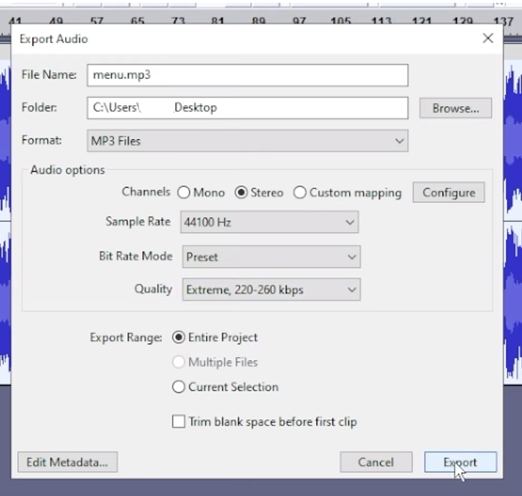
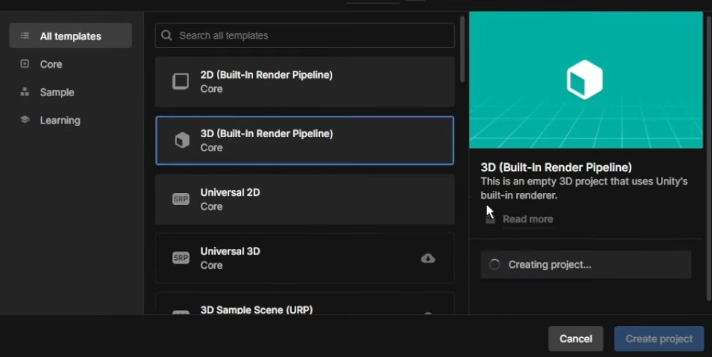

# 🚀 Custom Sound Effects for Unity 6 Games (Combat Master Example)

---

## 💡 Overview

This guide will walk you through the exciting process of crafting and implementing your very own custom sound effects in games built with **Unity 6**. While "Combat Master" is used as a practical example, the techniques covered here are broadly applicable to many Unity 6-based titles. Get ready to personalize your game's audio experience!

## ⚠️ Disclaimer

This guide is provided for educational and informational purposes only. When modifying game files, always ensure you respect all applicable laws, the game's terms of service, and intellectual property rights. Modifying game files can sometimes lead to unexpected game behavior, instability, or even account penalties. **Proceed at your own risk.**

---

## 🛠️ Required Applications & Credits

Before diving in, make sure you have the following essential applications downloaded and installed. Specific versions are recommended where noted to ensure compatibility with Unity 6 and the outlined workflow.

* ### Unity Hub & Unity Editor (Unity 6)
    * **Purpose:** To create a simple Unity project. This project will serve as a vessel to generate a dummy `.assets` file containing your custom audio, which we'll then use as a template.
    * **Download:** ```[https://unity.com/download](https://unity.com/download)```

* ### AssetStudioGUI
    * **Version:** ```v0.18.0``` (crucial for compatibility with the demonstrated process).
    * **Purpose:** To extract existing game assets (like original sound effects) and, most importantly, identify their unique `PathID`.
    * **Download:** ```[https://github.com/aelurum/AssetStudio/releases/tag/v0.18.0](https://github.com/aelurum/AssetStudio/releases/tag/v0.18.0)```

* ### UABEA (Unity Asset Bundle Extractor)
    * **Version:** The **Nightly version** explicitly compatible with Unity 6. Older versions might not correctly handle Unity 6 asset formats.
    * **Purpose:** This powerful tool is used to inject your prepared custom audio data directly into the game's `.assets` files.
    * **Download:** ```[https://nightly.link/nesrak1/UABEA/workflows/dotnet-desktop/master/uabea-windows.zip](https://nightly.link/nesrak1/UABEA/workflows/dotnet-desktop/master/uabea-windows.zip)```
    * **Important Note:** Always verify that the UABEA version you download explicitly supports Unity 6 to avoid compatibility issues.

* ### Audacity (or your preferred Audio Editor)
    * **Purpose:** Essential for editing and exporting your custom sound effects in a compatible format (like MP3 or WAV).
    * **Download:** ```[https://www.audacityteam.org/download/](https://www.audacityteam.org/download/)```

---

## 📋 Step-by-Step Tutorial

This guide assumes basic familiarity with navigating files and folders on your operating system.

### Part 1: Preparing Your Custom Sound Effect 🔊

1.  **Open Audacity:** Launch Audacity or your audio editor of choice.
2.  **Import Your Audio:** Drag and drop your custom sound effect into Audacity.
3.  **Edit the Audio (Optional but Recommended):**
    * Cut, trim, or apply effects to fine-tune your audio.
    * **Adjust Volume:** To precisely control the volume, press `Ctrl+A` (to select all audio), then go to `Effect` > `Volume and Compression` > `Amplify`. Adjust the amplification slider as needed and click `Apply`.
4.  **Export Your Audio:**
    * Go to `File` > `Export` > `Export Audio`.
    * **Select Export Path:** Choose a convenient location to save your file (e.g., your Desktop).
    * **Format:** Select either `MP3` or `WAV`. MP3 generally results in smaller file sizes.
    * **Sample Rate:** Set this to `44100 Hz` (or match the game's sample rate if known).
    * **Quality (for MP3):** For the best results, select `Extreme`.
    * Click `Export`. If prompted, you can choose to replace an existing file.
    ---
    
    ---
5.  **Close Audacity:** Once your audio is successfully exported, you can close Audacity.

### Part 2: Generating a Dummy Asset with Unity Editor 🎮

This crucial step involves creating a small `.assets` file that will contain your custom audio. UABEA will later use this file as a template for injection.

1.  **Open Unity Hub:** Launch the Unity Hub.
2.  **Create a New Project:**
    * Click `New Project`.
    * Select the `3D Core` template (or a similar standard 3D template).
    * Give your project a meaningful name (e.g., `AudioModProject`).
    * Click `Create Project`.
    * *Note: This process may take a few moments depending on your PC's specifications.*
    ---
    
    ---
3.  **Import Audio into Unity:**
    * Once the Unity Editor loads, drag and drop your exported custom audio file (MP3/WAV) from **Part 1** into the `Project` window (usually located at the bottom of the Unity interface).
    ---
    
    ---
4.  **Add Audio to Scene:**
    * Drag your newly imported audio file from the `Project` window into the `Scene` window. This action will create an `AudioSource` component in your scene.
5.  **Build the Project:**
    * Go to `File` > `Build Settings`.
    * Click `Build`.
    * **Create a New Folder:** Choose a location on your computer (e.g., your Desktop) and create a new, empty folder. Name it something like `Build`.
    * Select this newly created `Build` folder and click `Save`.
    * Unity will now compile and build your project, generating the necessary `.assets` files.
    ---
    
    ---
6.  **Close Unity Editor:** After the build process is complete, you can safely close the Unity Editor.

### Part 3: Extracting and Preparing the Target Asset 🔍

This section guides you through using AssetStudioGUI to pinpoint the exact asset you wish to replace within your game's files.

1.  **Locate Game Files:**
    * Navigate to your game's installation directory (e.g., `C:\Program Files (x86)\Steam\steamapps\common\Combat Master`).
    * Inside the game's main directory, look for a folder named `[GameName]_Data` or simply `Data`.
    * Within the `Data` folder, you'll typically find `.assets` files (e.g., `resources.assets`), and sometimes `.bundle` files located inside a `StreamingAssets\Bundles` folder.

2.  **Open AssetStudioGUI:** Launch `AssetStudioGUI.exe` from the `v0.18.0` release you downloaded.

3.  **Load Game Files:**
    * Go to `File` > `Load Folder`.
    * Browse to your game's `Data` folder (or the `StreamingAssets\Bundles` folder if you suspect the audio is there) and select it. AssetStudioGUI will begin parsing the game's assets.
    ---
    
    ---
4.  **Find the Target Audio:**
    * Once assets are loaded, use the search bar at the top or apply filters (e.g., filter by `AudioClip`) to locate the specific sound effect you intend to replace. For example, if you're replacing "menu audio," type `menu` in the search bar.
    * **Crucial Step: Copy PathID:** Select the desired audio clip from the results list in the left pane. In the right-hand pane, find the `PathID` field. Right-click on the numerical value next to `PathID` and select `Copy text`. **Save this `PathID` somewhere safe** (e.g., in a Notepad document); you will need it in the next step.
    ```text
    <copied_path_id_value_here>
    ```
    ---
    
    ---
5.  **Close AssetStudioGUI:** You can close AssetStudioGUI once you have successfully copied the `PathID`.

### Part 4: Modifying the Asset with UABEA 💉

This is where the magic happens: you'll inject your custom audio directly into the game's files.

1.  **Locate Your Dummy Asset:**
    * Go back to the `Build` folder you created in **Part 2**.
    * Inside, navigate to `[ProjectName]_Data` (e.g., `AudioModProject_Data`).
    * You'll find files like `sharedassets0.resource` and `sharedassets0.assets`. These contain the dummy asset we generated with your custom audio.
    * **Rename the Dummy Resource File:** Right-click on the `sharedassets0.resource` file and rename it to something distinct.
        ```text
        menu_custom.resource
        ```
        or
        ```text
        mycustomsound.resource
        ```
        This helps prevent confusion with the game's original files.

2.  **Open UABEA:** Launch `UABEA`.

3.  **Load Your Dummy Asset & Export Dump File:**
    * Drag and drop the **`sharedassets0.assets` file** (from your `Build` folder, NOT the renamed `.resource` file) into the UABEA window.
    * In the list, find your custom audio clip (it will likely be of type `AudioClip`).
    * **Export Dump:** Select your custom audio clip, then click `Export Dump`. Save this dump file to a convenient location (e.g., a new folder called `dumps`).
        ```text
        my_custom_audio.txt
        ```
        This `.txt` file contains the data of your custom sound.

4.  **Edit the Dump File:**
    * Open the newly created `.txt` dump file (e.g., `my_custom_audio.txt`) with a text editor (like Notepad).
    * You will see a line referring to the original resource file (e.g., `sharedassets0.resource`). **Change this line to the name you used for your renamed dummy resource file** (e.g., `menu_custom.resource`). This is crucial for UABEA to correctly locate the resource when importing.
    ---
    
    ---
    * *Example of what to change in the dump file:*
        **Original line:**
        ```text
        <original_path_to_resource_file>/sharedassets0.resource
        ```
        **Change to (example):**
        ```text
        <original_path_to_resource_file>/menu_custom.resource
        ```
    * *Optional Batch File Utility:* If you have a batch file that automates this renaming process for multiple dump files, you can use it here. Simply drag multiple dump files onto the batch file, and enter the name of the resource file.

    Keep UABEA open.

5.  **Load the Game's Original Asset File in UABEA:**
    * In the *same UABEA window*, go to `File` > `Open`.
    * Navigate to your game's `Data` folder and select the **game's original** `resources.assets` file (or the specific `.bundle` file where your target audio was found in AssetStudioGUI).
    * **Important:** This is the *game's actual asset file*, not the dummy one you created.

6.  **Inject Your Custom Audio:**
    * In UABEA, click on `Info`.
    * In the `Asset Info` window, click `View`.
    * In the search bar, paste the `PathID` you copied from AssetStudioGUI (from **Part 3, Step 4**).
        ```text
        <pasted_path_id_value_here>
        ```
        Click `Okay`. This action will highlight the original game audio asset you intend to replace.
    * With the correct asset highlighted, click `Import Dump`.
    * Browse to the location where you saved your custom audio dump file (e.g., `my_custom_audio.txt`) and select it.
        ```text
        my_custom_audio.txt
        ```
    * Click `Open`.
    * Close the `Asset Info` window.

7.  **Save Changes in UABEA:**
    * Go to `File` > `Save`.
    * Click `Okay` when prompted to confirm the save.
    * Click `Save` again in the main UABEA window (this writes the changes to the disk).
    * You can now close UABEA.

### Part 5: Finalizing the Installation ✅

You're almost there! Just a few more steps to get your custom audio into the game.

1.  **Copy Modified File:**
    * Go back to your `Build` folder (from **Part 2**).
    * Inside `[ProjectName]_Data`, copy the **renamed dummy resource file**.
        ```text
        menu_custom.resource
        ```
        (or whatever you named it).

2.  **Paste into Game Directory:**
    * Navigate to your game's `Data` folder (e.g., `C:\Program Files (x86)\Steam\steamapps\common\Combat Master\Data`).
    * Paste the copied `.resource` file here.

3.  **Test in Game:**
    * Launch your game!
    * Listen for your custom sound effect to confirm it's playing as intended. Enjoy your personalized audio!

---

## ❌ Troubleshooting

Encountering issues? Don't worry, here are some common solutions:

* **"Unknown Unity Version" or Errors:** This often indicates a compatibility problem. Ensure you are using the **latest compatible versions** of AssetStudioGUI and UABEA that specifically support Unity 6. Tool compatibility is absolutely critical.
* **No Assets Found:** Double-check that you are loading the correct game files (`.assets` or `.bundle` files) into AssetStudioGUI and UABEA. Make sure you're not trying to load general game executables.
* **Game Crashing:** A crash might occur if the asset structure was not correctly maintained during the injection or if the injected dump is somehow corrupted. Carefully re-verify each step, paying close attention to the `PathID` and the export/import of the dump.
* **Sound Not Playing:** Verify that your custom audio was exported correctly in **Part 1**. Also, ensure that the `PathID` you used in **Part 4** perfectly matches the target audio in the game.
